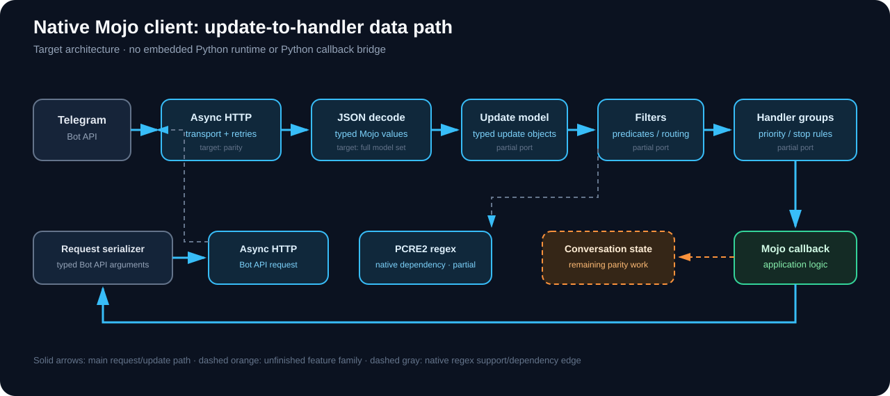

# python-telegram-bot native Mojo port

This workspace is the native Mojo port of `python-telegram-bot` v22.8. The
implementation belongs under `src/telegram/` and must not depend on CPython or
the upstream Python package at runtime. The source reference is the v22.8
upstream distribution, and `PORT_STATUS.csv` tracks every `.py` file under its
`src/telegram/` package against the corresponding `.mojo` file.

## Port coverage

The upstream package contains 233 Python files and 88,746 source lines. The
status ledger is authoritative: a file is complete only after its translated
Mojo implementation and corresponding behavior have been reviewed. The full
port includes the public `telegram` API, request layer, helpers, errors, and
all of `telegram.ext`, as well as the original optional integrations.

The native `Bot` core validates tokens and URL templates, owns separate API
and update request values, normalizes endpoint names, builds URL-encoded
parameters, supports raw `do_api_request`, `get_me`, initialization/shutdown,
identity shortcuts, typed message send/delete, bulk delete/forward/copy,
photo/document/audio/sticker/video/animation/voice/video-note sends, location,
venue, contact, dice, and native poll operations, chat/member lookup and
moderation, invite links and join requests, forum topics, reactions, business
connection lookup, default administrator rights, chat title/description and
permission changes, leave/pin/unpin, webhook setup and status, update polling,
callback/inline/payment/Web App query answers, prepared inline messages, command
and menu-button configuration, bot name/description configuration, and profile-
photo retrieval. It also covers chat actions, draft-message streaming, emoji
status, topic-icon and custom-emoji sticker lookup, sticker-set lookup and
management, `InputSticker` add/create/replace operations and multipart upload,
available-gift lookup, gift sending/listings/conversion/upgrade/transfer,
guest-query answers, Stars balance/transaction/refund/subscription operations and premium
gifts, business-account profile/gift/message/balance settings and operations,
managed-bot token and access settings, chat/user verification, member tags, user boost/profile-audio
lookup, personal-chat message retrieval, suggested-post review, checklist
send/edit, bot profile-photo changes, forum General-topic management, and
reply-markup edits. File sends accept native `InputFile` uploads or file IDs.
Additional wrappers cover story post/edit/repost/delete, invoice and invoice-link
requests, passport-data error submission, prepared keyboard-button saving,
live-photo sends, media-group and paid-media requests, and live-location edits.
The `InputMedia` and
`InputPaidMedia` values serialize media fields and associate nested uploads with
multipart `attach://` references. Bulk message methods decode typed `MessageId`
results; `get_updates` uses the separate request object and preserves unknown
update API parameters. Many endpoint wrappers still lack parts of the upstream
keyword, timeout, default-insertion, and input-sequence behavior. `HTTPXRequest` uses Mojo FFI with system libcurl for
synchronous GET/POST, TLS verification,
timeouts, HTTP version selection, response buffering, multipart form and binary
file uploads, and Bot API error mapping. Callable URL builders, arbitrary
request backends, connection pooling, proxy/socket options, richer per-variant
input-media constructors, parsed/cached private-key object semantics, and async
behavior remain under translation. Passport crypto uses the system OpenSSL
`libcrypto.so.3` through Mojo FFI for RSA-OAEP and AES-256-CBC operations.
Regex-backed handlers load system `libpcre2-8.so.0`; PCRE2 provides anchored
Unicode matching for common Python `re` patterns, but syntax edge cases differ
and the current API does not expose Python `Match` captures.
The `PTBUserWarning`, `PTBRuntimeWarning`, and `PTBDeprecationWarning` values
preserve warning messages and deprecation formatting; they do not integrate
with Python's warning-category inheritance or warning filters. The native
transition helper builds upstream deprecation text and resolves string-valued
old/new argument pairs, returning a warning value for the caller to emit.

## Mojo target

The initial compiler target is Mojo 1.1.0 under Ubuntu 24.04 / WSL2. The port
uses native Mojo structs, traits, collections, and JSON serialization. The
current HTTP path dynamically loads the system `libcurl.so.4` and `libc.so.6`
through Mojo FFI. Passport and regex support dynamically load system
`libcrypto.so.3` and `libpcre2-8.so.0`. It does not load or call the Python package.

## Work order

1. Port shared value, error, serialization, date/time, and constants modules.
2. Port Telegram API value types and their JSON conversion behavior.
3. Port API method definitions, request transport, file uploads, and bot
   lifecycle.
4. Port `telegram.ext` application, updater, handlers, filters, persistence,
   job queue, and optional features.
5. Reconcile all source rows, compile every module, and run the upstream
   behavior suite adapted to Mojo.

## Current verification

The current native slice contains the version helpers, default-value wrappers,
string conversion, all constants, a native JSON parser/writer, and initial
message-ID, bot-name, bot-description, bot-command, CopyTextButton,
SentGuestMessage, and PreparedKeyboardButton model modules.
The native `Chat` value covers the v22.8 base fields, forward-compatible JSON
fields, stable ID equality, and local name/link/HTML/Markdown mention helpers.
`ChatFullInfo`, Chat's Bot shortcut methods, and shared TelegramObject behavior
remain incomplete. `ChatFullInfo` currently has a native base `Chat`, its
required accent/reaction/gift fields, typed scalar/array field access, and
lossless JSON plus future-field retention; its full nested model/property
surface remains open.
`ChatInviteLink` covers required metadata, nested creator `User`, fixed-offset
expiry timestamps, limits, subscription duration/price, equality, and API
extension fields. Per-bot timezone localization remains pending.
`ChatJoinRequest` covers nested chat/user/invite-link values, 52-bit user chat
IDs, timestamp identity, optional bio, and the upstream `from` JSON key mapping.
Managed-bot creation and update events are native nested `User` models with
equality, JSON/list conversion, and unknown-field retention.
`AffiliateInfo` now models optional native `User` and `Chat` recipients,
commission amounts, identity, and forward-compatible JSON fields.
The current slice also includes `WebAppInfo`, `Dice`, and selected primitive
models from chat boosts, gifts, paid messages, suggested posts, unique gifts,
and Web Apps.
It also includes native scalar ports for `EncryptedCredentials` metadata,
`Invoice`, `LabeledPrice`, and `ShippingAddress`; credential decryption and
invoice limit constants are not implemented yet.
`BusinessConnection` and `BusinessMessagesDeleted` decode typed User/Chat/
rights values, timestamps, and deleted-message ID arrays. `BusinessIntro` and
`BusinessLocation` now decode optional Sticker and Location values, preserve
unknown fields, and follow their upstream equality identities. The business
opening-hours interval and computed weekday/hour/minute triples are native.
`BusinessOpeningHours` now stores typed intervals and preserves upstream
equality, hashing, and JSON behavior. IANA timezone resolution,
`get_opening_hours_for_day`, `is_open`, and shared base-object behavior remain
open.
Chat permission and administrator-rights values include their nullable fields,
JSON handling, and all/none constructors. Optional fields are omitted from
serialized objects when unset, matching the source object's dictionary rules.
Concrete solid, gradient, freeform-gradient, and chat-theme background values
also have native JSON/equality implementations. A tagged native `BackgroundFill`
parser handles known and unknown fill types; the `BackgroundType` dispatcher and
wallpaper/pattern/fill variants remain unported.
`Birthdate` includes JSON/equality and calendar validation through a native
Gregorian `Date` value. `TimeDelta` provides normalized microsecond durations
for live locations and auto-delete timer models. `TimestampDateTime` handles
POSIX conversion with fixed UTC offsets and microsecond precision. Named time
zones, Bot defaults, environment-controlled timedelta migration and warnings,
and zoneinfo lookup remain pending.
The error module now provides native tagged Telegram error values and named
constructors; Python subclass-based catching, retry-duration migration, and
pickling semantics remain language-specific work.
`LinkPreviewOptions` and the deprecated preview-argument resolver are native;
the resolver retains mutual-exclusion and precedence behavior, while generic
`DefaultValue` input identities remain incomplete.
The argument parser also has native homogeneous-list copying and optional
generic JSON decode/list dispatch through a Mojo trait. The selected-attribute
repr helper accepts explicit typed values and preserves caller order.
`TransactionPartner` is a native tagged value for all seven Stars partner
discriminators, with per-variant equality, nested model validation, factories,
and preservation of future JSON fields. Its User and Chat values, Gift,
AffiliateInfo, RevenueWithdrawalState, and paid-media values decode as native
models.
The gift module includes `Gift`, `Gifts`, and `GiftInfo` with nested sticker,
publisher chat, background, and message-entity values. Gift text entity parsing
uses Telegram's UTF-16 offsets and returns a native `Dict`. The paid-media
module includes preview, photo, video, and live-photo tags plus `PaidMediaInfo`
and `PaidMediaPurchased`; source subclass constructors are represented by
native tagged factories.
The unique-gift module covers all seven upstream models, including nested
models, symbols, backdrops, identity behavior, transfer metadata, and UTC
timestamp conversion. Bot-specific timezone localization remains open.
The owned-gift module has native regular/unique tags with typed nested gifts,
sender, and text entities, plus the paginated `OwnedGifts` value. Regular gift
entity extraction uses UTF-16 offsets; bot-specific timezone localization
remains open.
The reaction module now handles all three known reaction variants, unknown
future discriminators, and reaction counts as native JSON values.
`MessageReactionCountUpdated` and `MessageReactionUpdated` now use typed native
Chat/User/reaction values with timestamp identity, JSON/list conversion, and
future-field retention. Bot-default timezone localization, Python tuple
immutability, and shared `TelegramObject` behavior remain open.
`WebhookInfo` covers its equality fields, optional metadata, timestamp
conversion, allowed-update sequence, and future fields. Named Bot timezone
defaults, Python tuple behavior, and shared `TelegramObject` semantics remain.
The four `VideoChat*` service-message values cover duration/timestamp fields,
nested invited users, source identity, JSON/list conversion, and future fields.
Bot timezone defaults, Python integer-duration deprecation behavior, tuple
semantics, and shared `TelegramObject` behavior are still open.
`InputChecklistTask` and `InputChecklist` add native request values, nested
message entities, source equality identities, and JSON/list decoding. A separate
flag retains whether parse mode came from the `DEFAULT_NONE` sentinel; Python
Sequence/tuple behavior and full shared `TelegramObject` semantics remain open.
Chat membership now has a native tagged `ChatMember` value for all six known
statuses and native factories to construct each status, with status-specific
field schemas, required-field checks, User conversion, timestamps, and
unknown-field retention. `ChatMemberUpdated` decodes the before/after states
and reports changed fields as JSON. The port
does not yet provide Python's six subclass types, per-status direct properties,
Bot timezone defaults, or the original typed dictionary difference result.
The request preparation slice now includes in-memory `InputFile`,
`RequestParameter`, and `RequestData` values, including JSON payload bytes,
URL encoding, and multipart part collection. `HTTPXRequest` has a synchronous
libcurl transport for GET/POST form requests and multipart fields with in-memory
binary uploads, and routes responses through the native status/error mapper.
Streaming file handles, connection pooling, full timeout policy, per-operation
timeouts, and the async request lifecycle remain pending. Raw file downloads
are available through `HTTPXRequest.retrieve`.
Native model modules now also cover `Contact`, `ReplyKeyboardRemove`,
`CallbackGame`, `InputMessageContent` and its contact/venue variants, invoice
content with nested prices and tip arrays, and `ShippingOption` with nested
`LabeledPrice` conversion. Their focused tests are registered in
`tests/run_all.sh` and check required/optional fields, unknown API fields,
identity rules, and nested JSON round trips.
Inline keyboard buttons and markup now use native Mojo values for their
supported scalar and nested models, ordered grid conversion, and convenience
factories. The shared inline-result header and game result are also native.
The reply-keyboard slice now includes native `KeyboardButton`,
`KeyboardButtonRequestChat`, and `ReplyKeyboardMarkup` values, including request
variants, nested administrator rights, string-button normalization, keyboard
factories, source equality behavior, and future-field retention.
`SharedUser`, `ChatShared`, and `UsersShared` add native shared-identity values,
optional profile/chat photos, name/link helpers, legacy-field retention, and
JSON/list conversion.
`Message` now has native Mojo fields for 101 of its 115 upstream constructor
values: identity, nested user/chat data, text/caption entities, scalar metadata,
typed media and file attachments, and translated giveaway, video-chat, topic,
story, payment, gift, checklist, and business service models. It preserves the
upstream identity behavior, converts Bot API JSON, parses entities and clipped
quote overlaps using UTF-16 offsets, builds `ReplyParameters`, resolves topic
threads, extracts direct-message topic IDs, handles inaccessible messages, and
selects effective attachments in Bot API order. Recursive reply and pinned
messages and 14 fields whose model variants are not translated yet remain
native JSON payloads. Formatting/HTML/Markdown helpers, Bot shortcut methods,
timezone defaults, and full `TelegramObject` behavior remain open.
`CallbackQuery` now has native required/optional data fields, user parsing,
query-ID equality, JSON key mapping, and typed `MaybeInaccessibleMessage`
decoding for both ordinary and date-zero messages. Its async Bot/Message
shortcuts remain pending.
`Update` now represents all 25 Bot API event keys in upstream positional order,
decodes all 25 event payloads to typed native Mojo models, and computes
effective user, sender, chat, and message values. Equality/hash, future fields,
and JSON/list conversion are implemented; the source `ALL_TYPES` class
attribute is exposed as a native `all_types()` list factory, and cached Python
property semantics remain open. Chat boosts now include tagged and named
premium, gift-code, and giveaway source values, boost event models, and
user-boost collections, with variant-specific required-field validation.
`InlineQuery` includes its nested sender/location values, source identity and
limits, and the `from` JSON key mapping. Its Bot answer shortcut, arbitrary
Python callback objects, Python sequence coercion, polymorphic result dispatch,
and shared TelegramObject behavior remain open.
`InlineQueryResultCachedSticker` adds the cached sticker file ID, nested markup,
and generic inline-message content JSON.
`InlineQueryResultCachedAudio` adds cached audio file IDs, optional captions,
caption entities, markup, and inline-message content.
`InlineQueryResultCachedVoice` adds cached voice file IDs, its required title,
optional captions, caption entities, markup, and inline-message content.
`InlineQueryResultCachedDocument` adds cached document file IDs and required
title, with optional description/caption, caption entities, markup, and content.
`InlineQueryResultCachedGif` adds cached GIF file IDs, optional title/caption,
caption entities, markup, message content, and above-media caption settings.
`InlineQueryResultCachedMpeg4Gif` supports cached MPEG4 GIFs with captions,
markup, and above-media caption options. `InlineQueryResultCachedPhoto` adds
photo IDs, optional title/description/caption, markup, and caption settings.
`InlineQueryResultCachedVideo` adds required title/video IDs, optional
description/captions, markup, message content, and caption placement.
The non-cached `InlineQueryResultAudio` now models URL/title/performer,
microsecond audio duration, caption entities, markup, and message content.
The non-cached `InlineQueryResultVoice` also models its URL/title, duration,
caption entities, markup, and message content.
The URL-based `InlineQueryResultPhoto` supports thumbnail and photo URLs,
dimensions, caption metadata, and show-caption-above-media.
The URL-based `InlineQueryResultDocument` supports MIME type, document URL,
description/caption metadata, and optional thumbnail URL and dimensions.
URL-based GIF and MPEG4-GIF models are drafted with durations, dimensions,
thumbnail MIME types, caption entities, and preview placement.
`InlineQueryResultArticle` includes its required title/content and optional
URL, description, thumbnail, and markup fields.
`InlineQueryResultContact` includes phone/name, vCard, thumbnail, markup, and
generic inline-message content values.
`InlineQueryResultVenue` and `InlineQueryResultLocation` include coordinate
fields, provider metadata or live-location timing, optional thumbnails, and
nested markup/content values.
The three menu-button variants and their base model support native JSON
conversion, nested WebAppInfo, identity, and forward-compatible API fields;
Mojo's static model does not reproduce Python's subclass-returning factory.
Update-filter parsing normalizes scalar, optional, native list, and native set
inputs into deduplicated sets and strips one leading `@` from usernames.
Arbitrary Python collections, optional Set inputs, and immutable `frozenset`
results remain language-specific gaps.
The CLI reports the library and Bot API versions for the native runtime; Git
revision metadata and a Python-runtime line do not apply to this executable.
File-input helpers cover IDs, existing local paths, local-mode URIs, byte-list
uploads, and prepared InputFile values, including RequestParameter multipart
conversion. Python stream objects, arbitrary TelegramObject/tg_type dispatch,
and Windows-specific file URI behavior remain open.
`InputSticker` now uses that file layer for local-mode paths and multipart
uploads, serializes emoji/keyword lists and nested masks, and preserves API
kwargs. Python's dynamic file-input union and TelegramObject runtime behavior
remain open.
`InputProfilePhoto` represents the generic, static, and animated variants in a
native tagged value and prepares local or multipart uploads. Fractional frame
timestamps serialize as seconds; Python subclass dispatch and native
`datetime.timedelta` input remain open.
`InputStoryContent` adds photo/video story values, uploads, duration fields,
animation flags, and request multipart conversion. Python subclass identity
and arbitrary stream objects remain open.
`ShippingQuery` and `PreCheckoutQuery` now have native nested payment models,
JSON decoding, identity/hash behavior, and unknown-field retention. Their
asynchronous Bot answer shortcuts remain open with the request lifecycle.
`SuccessfulPayment` includes its composite charge identity, optional recurring
fields, nested `OrderInfo`, and UTC timestamp conversion; per-Bot timezone
defaults remain open.
Revenue-withdrawal pending/succeeded/failed states now use a tagged model with
succeeded dates and URLs. Python subclass dispatch and timezone defaults remain
open.
`StarTransaction` and `StarTransactions` now model amount/date/nanostar values
and ordered history, preserving partner payloads as JSON. Partner values are
also available through the native tagged `TransactionPartner` model.
The keyboard-shape helper checks native `List[List[T]]` inputs and rejects flat
string keyboards; Python tuple/Sequence introspection and mixed nested values
remain open.
`InputTextMessageContent` now includes text identity, optional parse mode,
native entity lists, link-preview options, legacy preview-flag resolution,
unknown-field preservation, and JSON/list conversion. Python's general
`Sequence`/tuple coercion, `DEFAULT_NONE` identity, and inherited
`TelegramObject` behavior remain language-specific gaps.
Spatial value coverage now includes native `Location`, `ChatLocation`, and
`Venue`, with nested JSON conversion and live-period `TimeDelta` support.
File metadata now includes `PhotoSize` and `VideoQuality`; their Bot-backed
download convenience still depends on the unfinished Bot/request layer.
The shared `_BaseMedium` and `_BaseThumbedMedium` data models now have native
file identity, optional size, typed thumbnail, JSON/list conversion, and future
field retention. The old `thumb` response key is preserved through `api_kwargs`.
Existing concrete media values still need to be connected to this shared model
contract, and their Bot shortcuts remain pending.
Sticker coverage now includes native `Sticker` and `StickerSet` values in
addition to `MaskPosition`; file-download shortcuts remain pending.
Optional string fields use Mojo's native `Optional[String]` type.
The scalar model slice now includes source-derived nullable string, integer,
and Boolean fields across several additional Telegram API objects.
The command-scope module supports default, global, and chat-scoped variants
with numeric or `@username` chat identifiers; polymorphic factory dispatch
remains open.
`MessageEntity` now models its fields, nested User/date-time values, JSON
conversion, UTF-16 text extraction, offset adjustment, and shifts; all 20
`ALL_TYPES` values are exposed. The entity helper now maps and filters entities
through the shared UTF-16 parser. Entity concatenation and timezone defaults
remain open.
The helper module includes native Markdown/HTML escaping, mentions, and deep
links; `effective_message_type` still depends on the unported Message/Update
model surface.
`tests/test_constants_data.mojo` checks all 620 enum
members against values extracted from the pinned v22.8 source. String
title/lower mappings use generated Unicode tables based on CPython 3.11 and
have per-codepoint parity assertions in `tests/test_unicode_strings.mojo`.
`tests/test_json.mojo` covers nested JSON, Unicode escapes, duplicate keys,
and compact/default serialization. `tests/test_messageid.mojo` covers the
current MessageId and bot-profile JSON and equality behavior; `tests/test_botcommand.mojo`
covers BotCommand JSON, equality, and limits. `tests/test_chat.mojo` covers Chat
metadata, mentions, equality, unknown-field round trips, and list decoding.
`tests/test_messageentity.mojo` covers entity identity, nested user/time values,
JSON conversion, UTF-16 text slicing, offset adjustment, and shifting.
`tests/test_entities.mojo` covers MessageEntity slicing, default filtering to
known Bot API types, explicit future-type filtering, and entity-keyed results.
`tests/test_basemedium.mojo` and `tests/test_basethumbedmedium.mojo` cover file
identity, optional size, nested thumbnails, legacy `thumb` preservation, and
unknown fields.
`tests/test_managedbot.mojo` covers nested User decoding, identity, unknown
fields, and list conversion. `tests/test_affiliateinfo.mojo` covers optional
nested decoding, identity/hash behavior, unknown fields, and JSON/list
conversion. `tests/test_datetime.mojo` covers POSIX/calendar boundaries,
offsets, pre-epoch timestamps, and fractional seconds. `tests/test_chatinvitelink.mojo`
covers nested decoding, expiration, duration, identity, and unknown fields.
`tests/test_chatjoinrequest.mojo` covers nested decoding, `from` mapping, large
IDs, instant equality, and unknown fields. `tests/test_preparedinlinemessage.mojo`
covers prepared-message ID identity, expiry timestamps, unknown fields, and JSON/list conversion.
`tests/test_inlinekeyboardbutton.mojo`, `tests/test_inlinekeyboardmarkup.mojo`,
`tests/test_inlinequeryresultgame.mojo`, `tests/test_inlinequery.mojo`,
`tests/test_inlinequeryresultcachedsticker.mojo`,
`tests/test_inlinequeryresultarticle.mojo`,
`tests/test_inlinequeryresultcontact.mojo`,
`tests/test_inlinequeryresultvenue.mojo`, and
`tests/test_inlinequeryresultlocation.mojo`,
`tests/test_inputtextmessagecontent.mojo`,
`tests/test_inlinequeryresultcachedaudio.mojo`,
`tests/test_inlinequeryresultcachedvoice.mojo`,
`tests/test_inlinequeryresultcacheddocument.mojo`, and
`tests/test_inlinequeryresultcachedgif.mojo`,
`tests/test_inlinequeryresultcachedmpeg4gif.mojo`, and
`tests/test_inlinequeryresultcachedphoto.mojo`, and
`tests/test_inlinequeryresultcachedvideo.mojo`,
`tests/test_inlinequeryresultaudio.mojo`, and
`tests/test_inlinequeryresultvoice.mojo`,
`tests/test_inlinequeryresultphoto.mojo`, and
`tests/test_inlinequeryresultdocument.mojo`, and
`tests/test_inlinequeryresultvideo.mojo`,
`tests/test_inlinequeryresultgif.mojo`, and
`tests/test_inlinequeryresultmpeg4gif.mojo` cover the added inline models.
`tests/test_menubutton.mojo` covers all menu-button variants, nested WebAppInfo,
identity/hash behavior, unknown fields, and list decoding. The focused update
filter checks are in `tests/test_update_parsing.mojo`; CLI formatting checks are
in `tests/test_cli_version.mojo`. `tests/test_file_helpers.mojo` covers path
checks, local upload and URI behavior, byte uploads, and request attachment
conversion. `tests/test_inputsticker.mojo` covers sticker IDs, local and byte
uploads, attachment collection, list copying, nested masks, API kwargs, and
empty optional fields. `tests/test_inputprofilephoto.mojo` covers static and
animated values, local and byte uploads, timestamps, and multipart conversion.
`tests/test_inputstorycontent.mojo` covers photo/video IDs, local and byte
uploads, duration serialization, animation flags, and multipart conversion.
`tests/test_markup.mojo` covers valid nested string rows, flat keyboard values,
and empty keyboard behavior.
`tests/test_paymentqueries.mojo` covers nested users, shipping addresses and
order info, from-key mapping, identities, and unknown fields.
`tests/test_successfulpayment.mojo` covers charge identities, recurring fields,
order info, expiration timestamps, lists, and future fields.
`tests/test_revenuewithdrawalstate.mojo` covers the three known states, unknown
future types, succeeded timestamps, identity, and list decoding.
`tests/test_startransactions.mojo` covers transaction and history values,
Telegram API partner payloads, source identity, timestamps, and future fields.
`tests/test_transactionpartner_variants.mojo` covers all partner tags, source
identity behavior, unknown tags and fields, nested validation, and list decoding.
`tests/test_gift.mojo` covers Gift/Gifts nested values, identities, unknown
fields, and required-field validation. `tests/test_paidmedia.mojo` covers each
paid-media tag, nested records, identities, history conversion, and purchases.
`tests/test_uniquegift.mojo` covers colors, nested unique gifts, source
identities, unknown fields, transfer dates, and list decoding.
`tests/test_ownedgift.mojo` covers both owned-gift tags, identity, UTF-16 entity
extraction, pagination, future tags, and required-field validation.
`tests/test_story.mojo` covers nested Chat conversion, chat/story identity,
future fields, JSON round trips, and list decoding.
`tests/test_storyarea.mojo` covers six position fields, all five tagged area
variants, nested reactions and addresses, unknown discriminators, and future
field retention.
`tests/test_reply.mojo` covers quoted text and UTF-16 entity extraction, reply
identity, number/string chat IDs, optional fields, future fields, and list decoding.
`tests/test_externalreplyinfo.mojo` covers nested origin/chat/media data,
origin identity, future fields, required-origin validation, and list decoding.
`tests/test_messageorigin.mojo` covers all four origin variants, nested users and
chats, source identity, timestamps, unknown types, and required-field validation.
`tests/test_pollanswer.mojo` covers option identities, nested voters, future
fields, and list decoding. `tests/test_pollmedia.mojo` covers all optional typed
media fields, nested photo arrays, equality, and forward-compatible fields.
`tests/test_polloption.mojo` covers required persistent IDs, optional nested
attribution/media, timestamps, UTF-16 entity extraction, identity, and list
decoding. `tests/test_poll.mojo` covers required poll data, options, all three
entity-bearing texts, durations, timestamps, identity, future types/fields, and
list decoding. `tests/test_inputpolloption.mojo` covers text, parse mode,
entities, identity, and lossless native JSON retention for its media field.
`tests/test_polloptionevents.mojo` covers added/deleted option events, poll
message payload retention, source identities, UTF-16 parsing, and list decoding.
InputPollOption media and service-event poll messages still need their typed
input-media and Message models.
`tests/test_checklists.mojo` covers task/checklist identity, nested completion
data, UTF-16 entity parsing, future fields, and list decoding.
`tests/test_game.mojo` covers game identity, nested photos, UTF-16 text entities,
future fields, and list decoding.
`tests/test_giveaway.mojo` covers scheduled giveaway rules, nested chats and
winners, timestamps, source identity, unknown fields, and list decoding.
`tests/test_giveawaycompleted.mojo` covers completion events; their optional
message payload is retained as native JSON until Message is typed.
`tests/test_messagereactionupdated.mojo` covers count and user reaction updates,
nested chat/user/actor-chat values, identity/hash, timestamps, unknown fields,
list decoding, and required-field errors.
`tests/test_webhookinfo.mojo` covers required and optional fields, both timestamp
values, allowed updates, identity/hash (including equal instants at different
offsets), unknown fields, list decoding, and malformed input.
`tests/test_videochat.mojo` covers all four service-message models, nested users,
fractional duration, timestamps, identity/hash, future fields, and list decoding.
`tests/test_inputchecklist.mojo` covers both request models, entity/task
round-trips, parse-mode sentinel state, identity/hash, future fields, and lists.
`tests/test_chatmember.mojo` covers known and unknown statuses, user parsing,
field access, timestamp conversion, equality/hash, unknown fields, and invalid
required fields. `tests/test_chatmemberupdated.mojo` covers event parsing,
before/after differences, nested values, unknown fields, equality/hash, and lists.
`tests/test_chatfullinfo.mojo`
covers its required fields, field access, future-field retention, and lossless
round trips. `tests/test_shared.mojo` covers shared IDs, optional photos,
name/link helpers, deprecated field retention, JSON/list conversion, and hashes.
`tests/test_callbackquery.mojo` covers query fields, User mapping, both message
union variants, unknown fields, identity/hash, and required fields.
`tests/test_update.mojo` covers native event decoding, effective values, the
ordered update-type list, future-field round trips, identity, and required IDs.
`tests/test_message.mojo` covers message identity, typed media and service
fields, UTF-16 entity and quote extraction, clipped entity overlaps, reply
arguments, topic/thread IDs, unknown-field round trips, links, accessibility,
attachment precedence, and the message union.
The keyboard button, request-chat, and reply-markup tests cover nested request
variants, factories, keyboard flags, JSON round trips, and source identity.
The latest confirmed full run covered all 147 registered programs under Mojo
1.1.0 on Ubuntu 24.04 / WSL2 and completed with process exit code 0. It includes
the expanded native Message model with 101 of 115 upstream fields represented
as typed Mojo values, nested media/service conversions, quote/reply helpers,
attachment selection, and typed accessible/inaccessible callback-message
handling. This verifies the current native slice; whole-library parity remains
open.
Focused tests cover file helpers, update-filter parsing, the CLI, InputSticker,
InputProfilePhoto, InputStoryContent, InputMedia/paid-media serialization and
multipart upload references, and keyboard shape validation. Local Bot API wire
tests also cover story, invoice, live-photo, live-location, album, and paid-media
requests. This
verifies the native slice only; whole-library parity remains open.

## Test fixture security

The development workspace has static private-key PEM fixtures in `tests/test_passport_crypto.mojo` and `tests/fixtures/passport_test_key_encrypted.pem`. The initial public snapshot omits those two test-only files until they can be replaced with ephemeral key generation. The crypto implementation remains under `src/`, and the omitted test is not part of `tests/run_all.sh`. No private-key PEM or bot-token pattern was found under `src/` during the release scan.

## Completion goal and benchmark hypotheses

Technical visuals and the assumptions behind them are in [the performance model and target data path](docs/technical-performance-model.md):

The project goal is a **native Mojo port of python-telegram-bot v22.8 with no
Python bridge**, eventually covering the complete public client, model, request,
and extension behavior. This is a goal, not a claim that parity has been reached.

The source ledger currently tracks 233 upstream modules: 9 complete, 199 in
progress, and 25 not started. Existing work includes a large set of native Bot
API models and method wrappers, libcurl request transport, OpenSSL Passport
decryption, PCRE2-backed regex predicates, and partial extension handlers and
filters. Those pieces have focused tests, but overall compatibility is not
certified.

### Potential outcomes

If the port reaches parity, it could provide a compiled Telegram Bot API client
without a CPython runtime dependency. Native execution could reduce interpreter
overhead in CPU-heavy model decoding and filter evaluation. Network-bound Bot
API calls would still be governed mostly by Telegram and network latency.

The following numbers are **hypothetical planning ranges, not measurements or
promises**:

| Workload | Hypothetical target vs. CPython PTB |
| --- | ---: |
| Decode and inspect small Update JSON | 1.2–2.5× throughput |
| Evaluate simple composed message filters | 1.5–4× throughput |
| Idle client memory | Measure first; no defensible target yet |
| End-to-end Bot API request latency | Likely similar on the same network |

These estimates need a parity-matched benchmark suite with identical inputs,
dependencies, hardware, compiler versions, and repeated runs. No benchmark
results are published yet.

### Major remaining work

- Complete `Application`, `ApplicationBuilder`, async update dispatch, callback
  invocation, and `CallbackContext` behavior.
- Port persistence, updater, job queue, rate limiters, conversation handling,
  and the remaining extension classes.
- Finish every model and Bot method, including exact defaults, timeouts,
  timezone, Bot association, serialization, identity, and error behavior.
- Preserve regex Match results and data-filter context propagation, then close
  the remaining filter families and constructor forms.
- Expand upstream-derived runtime tests and establish measured performance
  baselines before making any speed or memory claims.

`tests/test_filters.mojo` checks native filter-expression serialization,
composition names, AND/OR/XOR/inversion, and representative `StatusUpdate`
filter exports. `tests/test_filter_factories.mojo` smoke-tests scalar/list
identity and Dice constructors, mutable identity-filter operations, and Mention
ID, username, and User forms. The
Mention checks include UTF-16 entity slicing across an astral Unicode codepoint.
`telegram.ext.filters` module implements 46 upstream
`StatusUpdate` predicates, including the events not yet represented by typed
`Message` fields through retained JSON extension values. Runtime coverage for
message predicates still needs expansion. Sticker variant filters, the seven
fixed Dice emoji filters, and simple forwarding, forum, giveaway, message
metadata, and boost predicates are also present. Text and Caption exact-match
filters, SuccessfulPayment payload filters, Command start-position selection,
and Document MIME/category/extension filters are supported. Update-only
predicates use the same upstream message-update gate before inspecting update
fields. Entity and caption-entity type filters and language-prefix filters are
also present. Dice value filters now support generic and emoji-specific scalar
or list configurations. Mention filters support ID, username, and typed User
inputs. Chat, User, ViaBot, SenderChat, and ForwardedFrom filters support
constructor-time ID or normalized-username matching, including explicit
allow-empty variants; `SenderChat` also has native all/channel/supergroup
constants. They support native add/remove/set operations for IDs and usernames.
Getter results are `List` snapshots and setters are named methods, so the
assignable Python property and frozenset surface differs. `Regex` and
`CaptionRegex` perform PCRE2 Unicode searches; their results are Boolean, so
Python `Match` captures and `CallbackContext.matches` remain open. Other filter
families, broader runtime predicate coverage, short-circuit result handling,
and exact full nested Python namespace parity remain open.
`telegram.ext._handlers.basehandler` currently ports the block-default sentinel,
typed update-check delegation, and context collection hooks. Callback storage
and awaited callback/result handling remain open: Mojo 1.1 currently crashes or
fails compilation for generic async methods over arbitrary update/context types
and raising async callbacks. Native `PollHandler`, `PollAnswerHandler`,
`PreCheckoutQueryHandler`, `ShippingQueryHandler`, `BusinessConnectionHandler`,
`BusinessMessagesDeletedHandler`, `PaidMediaPurchasedHandler`,
`ManagedBotUpdatedHandler`, and `ChatJoinRequestHandler` implement typed event
predicates and block configuration. These filtered handlers accept typed `Set`
filters with ID-or-username matching; the managed-bot handler checks both the
creator and managed bot. `MessageHandler` applies its supplied native
`BaseFilter` (or `ALL`) to typed updates; data-filter context merging remains
open.
`ChatMemberHandler` implements the `MY_CHAT_MEMBER`, `CHAT_MEMBER`, and
`ANY_CHAT_MEMBER` predicates with optional chat-ID filtering. `TrackingDict`
tracks dirty keys, deletion markers, typed `setdefault`, None-aware `pop`,
`clear`, and FIFO `popitem`; its list-backed lookup is O(n), and
`keys`/`values`/`items` return snapshots.
Python mapping polymorphism, live view objects, and the exact `DELETED` sentinel
contract remain open.
`ChatBoostHandler` supports boost-added/changed and boost-removed event types,
chat-ID or normalized-username filters, and block-default resolution.
`ChosenInlineResultHandler` optionally matches chosen-result IDs with anchored
PCRE2 regexes. `InlineQueryHandler` optionally matches query text with anchored
PCRE2 regexes and supports chat-type filtering. `CallbackQueryHandler` matches
callback data or game names using the source XOR selection rule. `StringRegexHandler`
matches string updates with an anchored Unicode pattern. These ports return
native predicate results; Python `Match` groups and `CallbackContext.matches`
are not exposed yet, and PCRE2 syntax is not fully identical to Python `re`.
`PrefixHandler` forms case-insensitive prefix/command combinations, parses
arguments across Unicode whitespace, applies a default or supplied filter, and
distinguishes unmatched, filtered-out, and accepted updates.
`MessageReactionHandler` selects reaction event kinds and filters by chat or
actor identity, including the constructor restriction on user filters when
anonymous reaction events are allowed.
`CommandHandler` checks the leading `BOT_COMMAND` entity, normalizes command
names, parses Unicode-whitespace arguments, applies bool or exact-count
`has_args` rules, and defaults to `UpdateType.MESSAGES`. Because the current
native `Message` does not retain its associated `Bot`, callers set the bot
username on the handler before matching `@botname` commands. Its validator
uses PCRE2 Unicode decimal matching for `\d`; Unicode database versions can
still differ from the Python runtime. Callback/context/Application dispatch
remains open.
`DataCredentials` and `FileCredentials` preserve their shared hash aliases,
secret, unknown fields, and JSON/list conversion. `SecureValue`, `SecureData`,
and `Credentials` decode and encode their nested native values. `PassportFile`
converts Unix timestamps, retains future API fields, compares by
`file_unique_id`, and accepts file credentials through its decrypted factories.
`PersonalDetails`, `ResidentialAddress`, and `IdDocumentData` are JSON models.
`EncryptedPassportElement` preserves encrypted string/object data and typed
PassportFile values; both models now expose explicit native decryption paths.
Passport credentials use RSA-OAEP/SHA-1, SHA-512-derived AES-256-CBC keys, and
SHA-256 authentication. Passport element errors cover all nine source/type/detail
variants using tagged native values. Lazy cached properties, the exact typed
decrypted-data union, Bot-default timezone conversion, `get_file` integration,
and Python subclass identity remain open.
`TypeHandler[T]` uses a static Mojo type parameter and matches present optional
values; Python runtime type objects and subclass-aware `isinstance` behavior
remain unavailable in this slice.
`StringCommandHandler` preserves literal-space argument splitting, including
empty fields. Callback construction/context mutation and `Application`
integration remain pending across these handlers.
Shared `TelegramObject` behavior remains an open parity gap across this slice.
Run individual programs with `mojo run -I src tests/<name>.mojo` from this
directory. This slice is still in progress; `PORT_STATUS.csv` records the
remaining work, and no whole-library parity claim is made yet.

The source is LGPL-3.0-or-later upstream. The included license files preserve its
license terms and notices.
