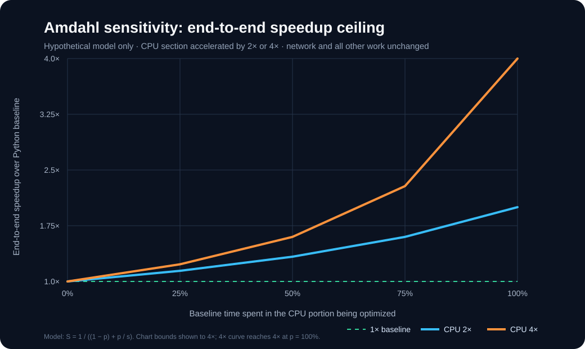
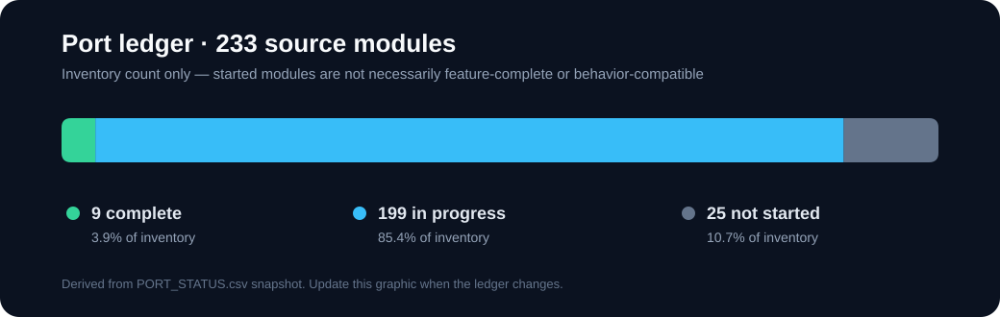
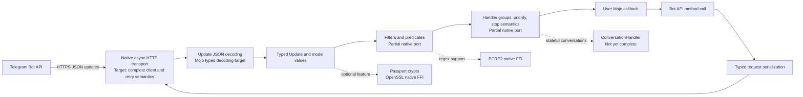

# Technical performance model and target architecture

This page is a planning model, not a benchmark report. No Mojo-versus-Python performance measurements have been collected. The speedup chart is derived from Amdahl's law and exposes how much of a workload would need to be accelerated for native Mojo work to matter.

## Sensitivity: end-to-end speedup versus accelerated CPU share

Assumptions: the accelerated portion is CPU-bound work (for example JSON conversion, filter matching, and handler dispatch); everything else, including Telegram network wait, is unchanged. Curves show a hypothetical 2× or 4× speedup in that CPU portion. For example, if only 25% of the baseline request time is accelerated, even a 4× faster CPU portion yields about 1.23× end-to-end speedup. If 75% is accelerated, the same assumption yields about 2.29×. These are mathematical scenarios, not observed performance.

| Baseline time in accelerated CPU work | CPU portion at 2× | CPU portion at 4× |
| ---: | ---: | ---: |
| 25% | 1.14× end-to-end | 1.23× end-to-end |
| 50% | 1.33× end-to-end | 1.60× end-to-end |
| 75% | 1.60× end-to-end | 2.29× end-to-end |

Formula: `S = 1 / ((1 - p) + p / s)`, where `p` is the fraction of baseline time spent in the accelerated CPU work and `s` is the speedup of that portion.

## Current port ledger

The ledger is a source-module inventory, not a percentage of user-visible behavior or test coverage. “In progress” means the module has been started; it does not imply parity. The current inventory is 233 modules: 9 complete, 199 in progress, and 25 not started.

## Native Mojo target data path

The diagram below is the intended no-Python-bridge architecture. Solid labels describe the current port direction; dashed/dotted styling marks broad components that still need implementation or parity work. External native libraries are implementation dependencies, not Python bridges.

## What a completed native port could enable

- A Mojo application could use typed Telegram models and handler APIs without embedding or calling a Python runtime.
- CPU-heavy update decoding, filter evaluation, serialization, and dispatch could use compiled native code; actual gains depend on profiling and the Mojo runtime/compiler.
- Applications could ship without Python package/runtime setup, subject to the final native dependency and platform packaging story.
- Network-bound bot workloads may see little latency change because Telegram round trips remain outside the local CPU path.

## Benchmark plan before making performance claims

1. Pin the Mojo compiler version, target CPU, operating system, build flags, and dependency versions.
2. Run the upstream Python implementation and the Mojo port against identical recorded update fixtures and a local Bot API stub.
3. Measure separately: JSON decode/model construction, filters, handler selection, request serialization, and an end-to-end mocked update cycle.
4. Report warm-up policy, repetitions, median and p95 latency, updates/second, and peak resident memory. Include correctness parity for every fixture.
5. Publish raw results and the command line used. Do not infer a speedup from the sensitivity chart above.

## Major remaining work

The port is still early: 199 modules are in progress and 25 have not been started. The remaining work includes completing every public module and its edge cases, matching async/network and error behavior, finishing handler and conversation semantics, filling out filters and API/model coverage, porting utilities and optional features, and proving parity with the upstream tests. The precise completion criteria and live per-module ledger are maintained in [`PORT_STATUS.csv`](../PORT_STATUS.csv).
